<!-- ╔══════════════════════════════════════════════════════════════════╗ -->
<!-- ║                          Roy Xue · @royxue                         ║ -->
<!-- ╚══════════════════════════════════════════════════════════════════╝ -->

<div align="center">


<a href="https://github.com/royxue">
  
</a>

<br/>

<a href="https://github.com/royxue?tab=followers">
  
</a>

<a href="https://github.com/royxue?tab=repositories">
  
</a>

</div>

---

## 👋 About Me

```yaml
name:       "Roy Xue"
role:       "Software Engineer"
coding_since: 2013
focus:
  - "Backend & systems in Go"
  - "Data / ML tinkering in Python"
  - "Developer & productivity tooling"
philosophy: "Build small, sharp tools that solve a real itch."
currently:  "Shipping open-source utilities for Obsidian, Things 3 & Dida365"
fun_fact:   "I will automate a 5-minute task with a 5-hour script. No regrets."
```

- 🔭 I build **developer & productivity tooling** — CLIs, plugins, and the kind of glue code that quietly saves people hours.
- 🌱 Comfortable across **Go, Python, and TypeScript**; happy to dive into whatever the problem needs.
- 🧪 Background in **data, ML & clustering** (pose estimation, GANs, co-clustering experiments).
- 💬 Ask me about **Obsidian plugins, Things 3 / Dida365 automation, or Mac dev setups**.

---

## 🛠️ Tech Stack

<div align="center">

#### Languages


#### Frameworks & Tools


#### Platform & Workflow


</div>

---

## 🚀 Featured Projects

<div align="center">

<a href="https://github.com/royxue/obsidian-things3-sync">
  
</a>
<a href="https://github.com/royxue/dida365-cli">
  
</a>

<a href="https://github.com/royxue/ippe-py">
  
</a>
<a href="https://github.com/royxue/power-armor">
  
</a>

</div>

> 🧩 **[obsidian-things3-sync](https://github.com/royxue/obsidian-things3-sync)** — Sync tasks between Obsidian and Things 3. My most-loved project (⭐ 100+).
> ✅ **[dida365-cli](https://github.com/royxue/dida365-cli)** — A native CLI for 滴答清单 (Dida365) with first-class Chinese support.
> 📐 **[ippe-py](https://github.com/royxue/ippe-py)** — Python port of Infinitesimal Plane-based Pose Estimation (IPPE).
> 🦾 **[power-armor](https://github.com/royxue/power-armor)** — One-command macOS development environment setup.

---

## 📊 GitHub Stats

<div align="center">


<br/>


</div>

---

## 🐍 Contribution Graph

<div align="center">

<picture>
  <source media="(prefers-color-scheme: dark)" srcset="https://raw.githubusercontent.com/royxue/royxue/output/github-contribution-grid-snake-dark.svg" />
  <source media="(prefers-color-scheme: light)" srcset="https://raw.githubusercontent.com/royxue/royxue/output/github-contribution-grid-snake.svg" />
  
</picture>

</div>

---

## 📈 Detailed Metrics

<div align="center">



</div>

---

## 🌐 Connect

<div align="center">

<a href="https://github.com/royxue">
  
</a>
<a href="https://royxue.github.io">
  
</a>
<a href="mailto:euxyor@gmail.com">
  
</a>

<br/><br/>

<i>“Build small, sharp tools that solve a real itch.”</i>


</div>
